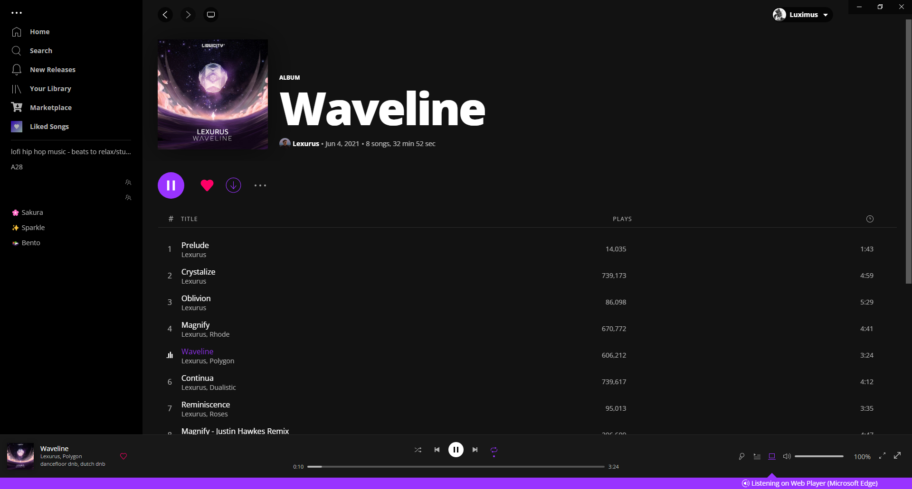
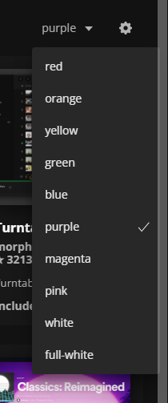

# Accented

Replace Spotify's green and remove unnecessary colors.



## Color options

- Red
- Orange
- Yellow
- Green
- Blue
- Purple
- Magenta
- Pink
- White
- Full White (also hearts)

## Installation

**Spicetify Marketplace** (recommended)

Install the theme though the [Spicetify Marketplace](https://github.com/CharlieS1103/spicetify-marketplace). This will allow you to change the color quickly in-app.



**Linux and MacOS** in Bash:

```bash
cd "$(dirname "$(spicetify -c)")/Themes"
git clone https://github.com/CharlieS1103/Glaze-theme
```

**Windows** in Powershell:

```powershell
cd "$(spicetify -c | Split-Path)\Themes"
git clone https://github.com/CharlieS1103/Glaze-theme
